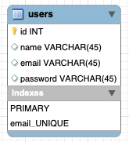

<div id="top"></div>

[](https://pkg.go.dev/github.dev/herlianto-github/http-basic)

[](https://github.com/herlianto-github/Http-Basic/graphs/contributors)


# Http Basic

<!-- Description -->
<div align="center">
  <a href="https://github.com/herlianto-github/Http-Basic/IMAGES/Golang_Http.png">
    
  </a>
</div>

# Database Schema

<!-- Description -->
<div align="center">
  <a href="https://github.com/herlianto-github/Http-Basic/IMAGES/ERD.png">
    
  </a>
</div>

# Table of Content

1. [About The Project](#http-basic)
2. [High Level Architecture](#high-level-architecture)
3. [Technology Stack](#technology-stack)        
    - [Package](#package)
    - [Database](#database)
    - [Deployment](#deployment)
    - [Collaboration](#collaboration)
4. [Folder Structure](#structuring)
5. [Unit Test](#unit-test)
6. [How To Contribute](CONRTIBUTING.md)
7. [Contacts](#authors)

  <p align="right">(<a href="#top">back to top</a>)</p>

# High Level Architecture
 <!-- High Level Architecture -->  
  <div align="center">    
    Coming soon
  </div>

  <p align="right">(<a href="#top">back to top</a>)</p>

# Technology Stack

### Package
- [net/http (Http)](https://pkg.go.dev/net/http)
- [Testify (Unit Test)](https://pkg.go.dev/github.com/stretchr/testify@v1.7.0)

### Database

- [MySQL (Open source database)](https://www.mysql.com)

### Deployment

- [Docker (Container images)](https://www.docker.com)
- [Okteto (Kubernetes platform)](https://www.okteto.com)
- [Kubernetes (Container Orchestration)](https://kubernetes.io)

### Collaboration

- [Github (Cloud-based Git repository)](https://github.com)

<p align="right">(<a href="#top">back to top</a>)</p>


# Structuring

  ```sh
    HttpBasic
    ├── configs                
    │     └──config.go           # Configs files
    ├── delivery                 # Endpoints handlers or controllers
    │     ├──common
    │     │   ├── global.go           # Constant variable
    │     │   └── http_responses.go   # Default http code, status, message
    │     ├──controllers
    │     │   └── users
    │     │     ├── formatter_req.go    # Default request format for spesific controllers
    │     │     ├── formatter_res.go    # Default response format for spesific controllers
    │     │     ├── users_test.go       # Unit tests for spesific controllers
    │     │     └── users.go            # Spesific controller
    │     ├──helpers
    │     │   └── helper.go           # Helper Function
    │     └──routes  
    │         └── routes.go           # Endpoints list
    ├── entities                
    │     └── users.go          # database model
    ├── repository              
    │     ├── interface.go      # Repository Interface for controllers
    │     ├── users_test.go     # Unit test for spesific repository
    │     └── users.go          # Spesific Repository
    ├── utils                 
    │     └── driver.go         # Database driver
    ├── .env                    # Individual working environment variables
    ├── .gitignore              # Which files to ignore when committing
    ├── go.mod                  
    ├── go.sum                  
    ├── main.go                 # Main Program
    └── README.md    
  ```

  <p align="right">(<a href="#top">back to top</a>)</p>


# Unit Test
<!-- Unit Test -->  
  <div align="center">
    coming soon
  </div>

  <p align="right">(<a href="#top">back to top</a>)</p>

# Contact
- [Herlianto](https://github.com/herlianto-github) (Developer and maintainer)
  - [LinkedIn](https://www.linkedin.com/in/herlianto-%E2%80%8D-829aa284/)
- [Ilham Junius](https://github.com/ilhamjunius) (Developer and maintainer)
  - [LinkedIn](https://www.linkedin.com/in/ilham-junius-767b49151)
- [Niendhitta Tamia Lassela](https://github.com/ellashella24) (Developer and maintainer)
  - [LinkedIn](https://www.linkedin.com/in/ntlassela/)

<p align="right">(<a href="#top">back to top</a>)</p>
